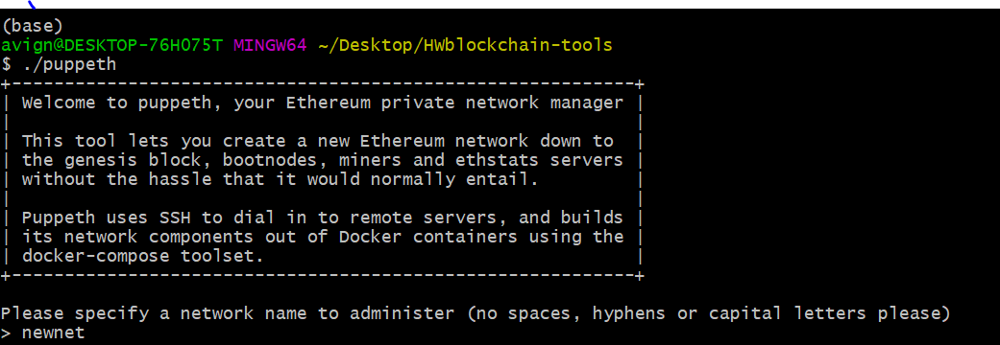
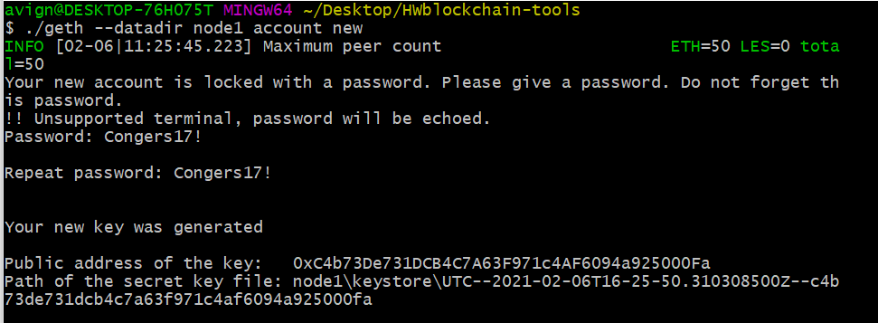
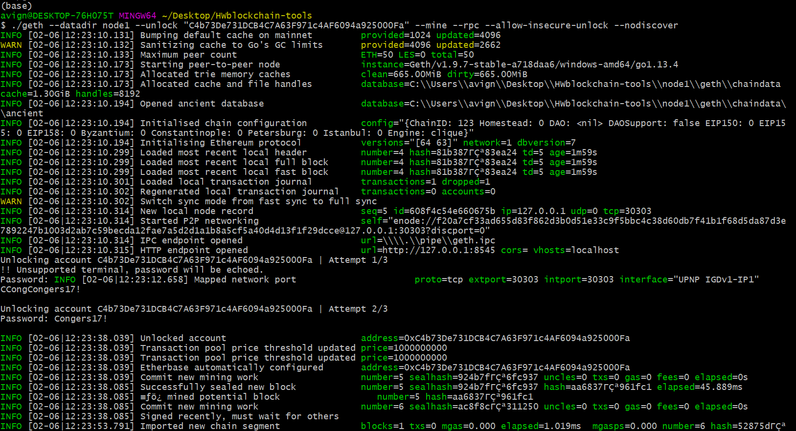
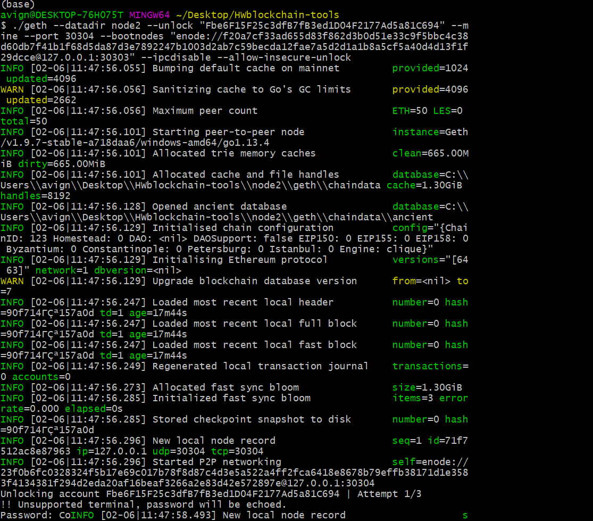
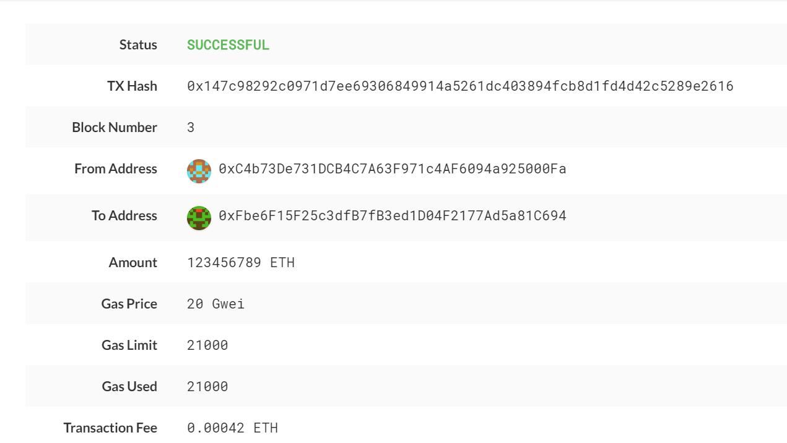

# BlockChainHW

## Enviornment Setup

1)  to set up the enviornment, in my "HWBlockchain-tools" folder (saved locally on my desktop) ran a command to create a new network- (./ puppeth) and called "newnet"
2)  configured newnet with PoA following the instructions in the gitlab repo

## Nodes

1) to create the nodes, ran a geth command -- ./ geth datadir node1 new account -- which creates new nodes based on rules established in the newnet network created above

2) Mining Node 1 - to beginning mining node 1, ran the geth command while referencing the first node created by the step above and the password for node 1

3) Mining Node 2 - with a new git bash window open (after traversing into the proper directory on my local machine) follow the same steps, but have to call in the enode reference to node 1 to properly link the two nodes

### MyCrypto

1) first step is to create a new custom network that links to your nodes created above
    - on the main page of MyCrypto app, click on "Change NewtorK" then "+ Add Custom Node"
    - on the "+ Add Custom Node" page, create a new network that links to the network you created in your git bash step above -- Network name: newnet, Network: custom,             Currency: ETH, Chain ID: same as you made in step 2 above (in this case 123)
    
    * Unfortunately I did not save this screenshot *
    
2) now that you have your custom network created, you will create a wallet based on the Keystore file created when you created Node 1
    - (while connected to custom network) Go to "View & Send"
    - select the option for Keystore File
    - using the GUI, select the keystore file from the node 1 folder created in your local drive when you created node 1 from steps above and enter the proper password
    - this will link your created wallet to the node 1 that is mining (to know it worked, your wallet balance should be incredibly wealthy)
    
     * Unfortunately I did not save this screenshot *
    
3) to send the test transaction, on the mainpage after having selected wallet
    - put public key for node 2 in the To Address field
    - enter amount to test send and select "Send Transaction"
    - a confirmation window should pop up where you can select "Check TXN Status"
    
    
    
    
Congratulations, you are now a crypto expert!
    
